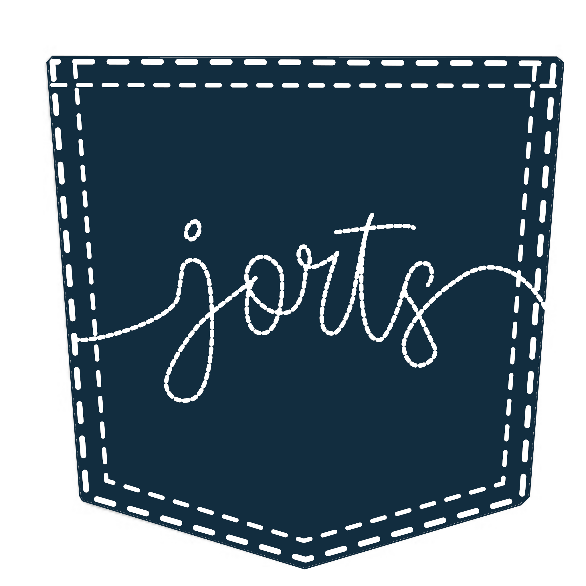

### JORTS -- Join Others, Rate Today's Styles

### Description
    JORTS is a unique social media platform combining the fun of sharing your daily outfits with the interactive twist of “Would You Rather.” Users are prompted to upload a daily outfit photo ("fit pic") and then participate in a game-like environment where they vote on other users' outfits. The platform enables users to share details about their clothing when posting their outfits, add reactions, and receive feedback from others, fostering a fashion-focused community.

## Core Features

## Video Demonstration

## Usage

## Installation
    Ensure that the following dependencies have been install on your machine before installation.

### Dependencies
    1.npm
    2.

